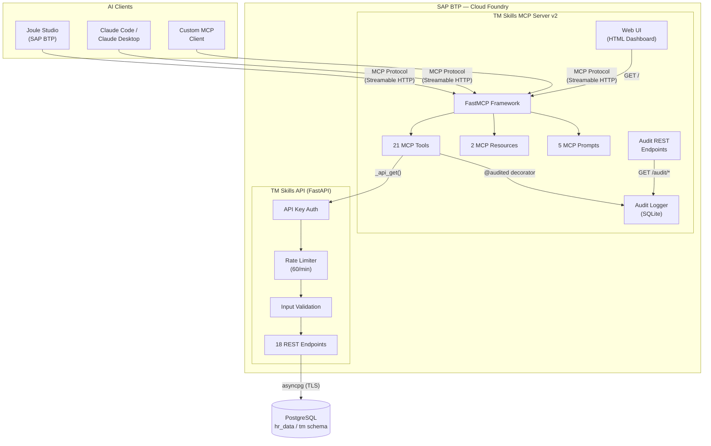
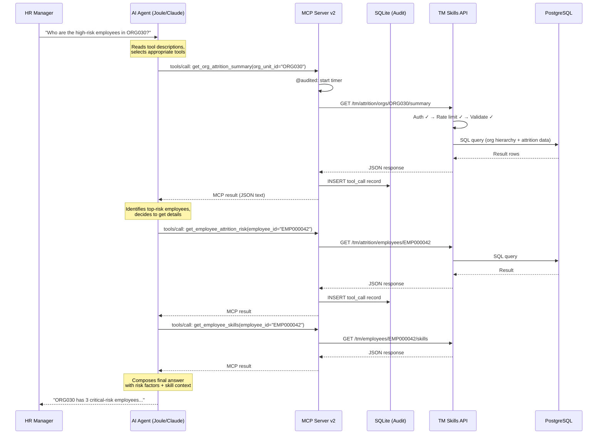
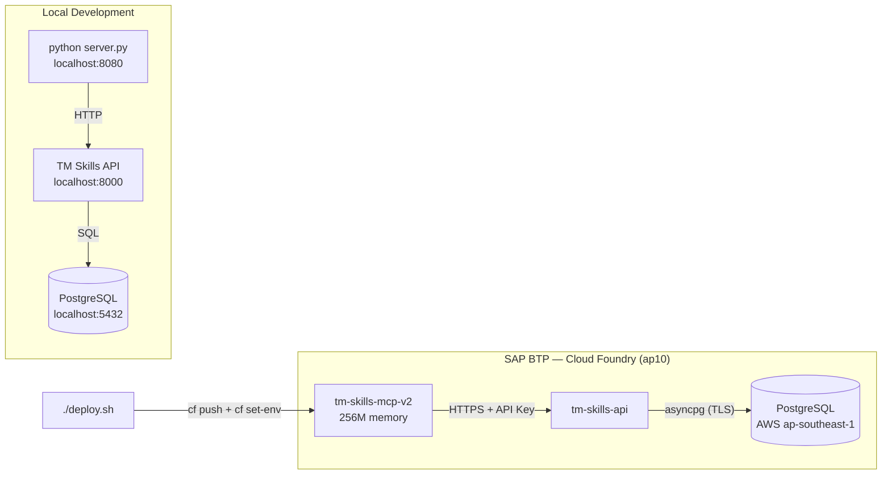

# Architecture — TM Skills MCP Server v2

## Overview

The TM Skills MCP Server v2 is a **protocol bridge** that translates AI agent requests (MCP protocol) into HTTP API calls against a Talent Management Skills API. It adds attrition prediction capabilities, audit logging, and a web UI on top of the original v1 server.

The server does **not** access the database directly — all data flows through the REST API, preserving the API's authentication, rate limiting, and input validation.

## System Architecture

## Data Flow

## Component Details

### MCP Server (`server.py`)

The core of the project. Responsibilities:
- **21 MCP Tools**: Each tool wraps a single API endpoint. The AI agent reads tool descriptions to decide which to call.
- **2 Resources**: Static context (database schema, business questions) loaded into the AI's context window.
- **5 Prompts**: Reusable multi-step workflows that guide the AI through complex analyses.
- **Audit REST endpoints**: Plain HTTP endpoints (`/audit/recent`, `/audit/query`, `/audit/summary`) for querying audit data without an MCP client.
- **UI view**: HTML dashboard at `/` listing all tools, resources, and prompts.

### Audit Logger (`audit.py`)

SQLite-backed audit trail for compliance and debugging:
- Records every tool invocation (tool name, parameters, duration, success/failure)
- Captures MCP session metadata (session ID, client name/version)
- WAL mode for concurrent read/write performance
- Lazy initialization — works even if no MCP client has connected yet

### Configuration (`config.py`)

Environment-aware settings via `pydantic-settings`:
- Reads from `.env` locally, from CF environment variables in production
- No code changes between local dev and production deployment

## Deployment

## Security Model

| Layer | Mechanism |
|-------|-----------|
| AI Client → MCP Server | MCP protocol over HTTPS (TLS in production) |
| MCP Server → TM API | API key in `X-API-Key` header |
| TM API → PostgreSQL | Connection credentials (TLS) |
| Secret management | API key injected via `cf set-env`, never in manifests or VCS |
| Rate limiting | 60 requests/min enforced at API layer |
| Input validation | Pydantic models at API layer (ID format, value ranges) |
| CORS | Restricted origins for monitoring dashboard |
