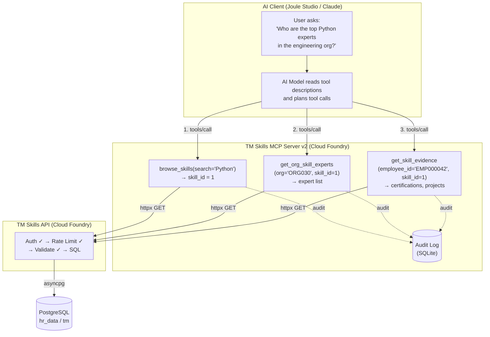

# Model Context Protocol (MCP) — A Complete Guide

## What Problem Does MCP Solve?

Imagine you have an AI assistant (Claude, GPT, Joule, etc.) and you want it to interact with your company's systems — look up employee data, check skill profiles, query databases. Before MCP, every AI platform had its own proprietary way of connecting to external tools. If you built a plugin for one platform, it wouldn't work on another.

**MCP is a universal standard** — like USB for AI tool connections. Build one MCP server, and any MCP-compatible AI client can use it.

```
Before MCP:                          After MCP:

┌─────────┐  custom plugin           ┌─────────┐
│ Claude   │◄───────────► System A   │ Claude   │◄──┐
└─────────┘                          └─────────┘   │
                                                    │  same MCP
┌─────────┐  different API           ┌─────────┐   │  protocol
│ Joule    │◄───────────► System A   │ Joule    │◄──┤
└─────────┘                          └─────────┘   │
                                                    │
┌─────────┐  yet another API         ┌─────────┐   │   ┌──────────┐
│ Copilot  │◄───────────► System A   │ Copilot  │◄──┘───│ MCP      │
└─────────┘                          └─────────┘       │ Server   │
                                                        │ (your    │
 3 integrations for 1 system          1 server for all  │ system)  │
                                                        └──────────┘
```

---

## The Core Concepts

MCP has exactly **two roles** and **three primitives**.

### Two Roles

```
┌──────────────────┐                    ┌──────────────────┐
│   MCP CLIENT     │   MCP Protocol     │   MCP SERVER     │
│                  │◄──────────────────►│                  │
│  (the AI app)    │   JSON-RPC 2.0     │  (your code)     │
│                  │                    │                  │
│  Examples:       │                    │  Examples:       │
│  - Claude Desktop│                    │  - Your API      │
│  - Claude Code   │                    │  - A database    │
│  - Joule Studio  │                    │  - A file system │
│  - Any AI agent  │                    │  - Slack, GitHub │
└──────────────────┘                    └──────────────────┘
```

- **Client** — The AI application that wants to use external tools. The client discovers what the server offers and invokes tools on behalf of the AI model.
- **Server** — Your code that exposes capabilities. It declares what tools, resources, and prompts it has, and executes them when asked.

### Three Primitives

These are the three types of things an MCP server can expose:

```
┌─────────────────────────────────────────────────────────────────┐
│                        MCP SERVER                               │
│                                                                 │
│  ┌─────────────┐  ┌──────────────┐  ┌───────────────────┐      │
│  │   TOOLS     │  │  RESOURCES   │  │     PROMPTS       │      │
│  │             │  │              │  │                   │      │
│  │ Functions   │  │ Read-only    │  │ Prompt templates  │      │
│  │ the AI can  │  │ context the  │  │ that guide the    │      │
│  │ call to DO  │  │ AI can READ  │  │ AI on HOW to      │      │
│  │ something   │  │ for context  │  │ use the tools     │      │
│  │             │  │              │  │                   │      │
│  │ Like:       │  │ Like:        │  │ Like:             │      │
│  │ - API calls │  │ - DB schema  │  │ - "Find experts"  │      │
│  │ - DB queries│  │ - Config     │  │   (step-by-step   │      │
│  │ - Actions   │  │ - Docs       │  │    recipe)        │      │
│  └─────────────┘  └──────────────┘  └───────────────────┘      │
│                                                                 │
│  Analogy:          Analogy:          Analogy:                   │
│  "verbs"           "nouns"           "recipes"                  │
│  (do this)         (know this)       (follow these steps)       │
└─────────────────────────────────────────────────────────────────┘
```

#### 1. Tools — "What the AI can DO"

Tools are functions the AI can invoke. Each tool has a name, description, and typed parameters. The AI model reads the description to decide when and how to use it.

```
Tool: get_employee_skills
  Description: "Get the full skill profile for an employee"
  Parameters:
    - employee_id: string (e.g. "EMP000001")
  Returns: JSON string with skills, proficiency, confidence
```

When a user asks "What skills does Zen Hamilton have?", the AI:
1. Reads the tool description
2. Decides this tool is relevant
3. Calls it with `employee_id="EMP000001"`
4. Gets back JSON and presents it to the user

#### 2. Resources — "What the AI can READ for context"

Resources are read-only data the AI can reference to understand the domain. They're loaded into the AI's context window as background knowledge.

```
Resource: tm://schema
  Content: The full database schema DDL
  Purpose: So the AI understands what tables/columns exist

Resource: tm://business-questions
  Content: 17 business questions with API mappings
  Purpose: So the AI knows what questions can be answered
```

The AI doesn't "call" resources like tools — it reads them for context, like a developer reading documentation before writing code.

#### 3. Prompts — "Reusable workflows"

Prompts are templates that pre-fill a conversation with structured instructions. They guide the AI through multi-step workflows.

```
Prompt: find_experts(skill_name="Python")
  Expands to:
    "I need to find the top experts in Python.
     1. Use browse_skills to find the skill ID for Python
     2. Use get_top_experts with that skill ID
     3. For the top 3 experts, use get_skill_evidence
     4. Summarize the findings"
```

Think of prompts as saved recipes that a user can trigger instead of typing the full instruction every time.

---

## How MCP Communication Works — Step by Step

All MCP communication uses **JSON-RPC 2.0** — a simple request/response protocol where every message is a JSON object.

### The Lifecycle

```
┌──────────┐                                          ┌──────────┐
│  CLIENT   │                                          │  SERVER   │
│  (Joule)  │                                          │  (yours)  │
└─────┬─────┘                                          └─────┬─────┘
      │                                                      │
      │  ──── Phase 1: INITIALIZATION ────────────────────   │
      │                                                      │
      │  1. {"method": "initialize", ...}                    │
      │  ─────────────────────────────────────────────────►  │
      │                                                      │
      │  2. {"result": {capabilities, serverInfo, ...}}      │
      │  ◄─────────────────────────────────────────────────  │
      │                                                      │
      │  3. {"method": "notifications/initialized"}          │
      │  ─────────────────────────────────────────────────►  │
      │                                                      │
      │  ──── Phase 2: DISCOVERY ─────────────────────────   │
      │                                                      │
      │  4. {"method": "tools/list"}                         │
      │  ─────────────────────────────────────────────────►  │
      │                                                      │
      │  5. {"result": {tools: [{name, description,          │
      │       inputSchema}, ...]}}                           │
      │  ◄─────────────────────────────────────────────────  │
      │                                                      │
      │  6. {"method": "resources/list"}                     │
      │  ─────────────────────────────────────────────────►  │
      │                                                      │
      │  7. {"result": {resources: [{uri, name,              │
      │       description}, ...]}}                           │
      │  ◄─────────────────────────────────────────────────  │
      │                                                      │
      │  8. {"method": "prompts/list"}                       │
      │  ─────────────────────────────────────────────────►  │
      │                                                      │
      │  9. {"result": {prompts: [{name, description,        │
      │       arguments}, ...]}}                             │
      │  ◄─────────────────────────────────────────────────  │
      │                                                      │
      │  ──── Phase 3: USAGE (repeated) ──────────────────   │
      │                                                      │
      │  10. User asks: "Who are the Python experts?"        │
      │                                                      │
      │  11. AI decides to call browse_skills tool           │
      │      {"method": "tools/call",                        │
      │       "params": {"name": "browse_skills",            │
      │                  "arguments": {"search": "Python"}}} │
      │  ─────────────────────────────────────────────────►  │
      │                                                      │
      │  12. Server executes the tool (calls your API)       │
      │                                                      │
      │  13. {"result": {content: [{type: "text",            │
      │       text: "{\"skills\": [...]}"}]}}                │
      │  ◄─────────────────────────────────────────────────  │
      │                                                      │
      │  14. AI reads result, may call more tools...         │
      │                                                      │
      │  15. AI presents answer to user                      │
      │                                                      │
```

### Phase 1: Initialization (the handshake)

The client and server agree on protocol version and declare their capabilities.

```json
// Client → Server: "Hi, I'm Joule, I support MCP protocol v2024-11-05"
{
  "jsonrpc": "2.0",
  "id": 1,
  "method": "initialize",
  "params": {
    "protocolVersion": "2024-11-05",
    "clientInfo": {"name": "Joule Studio", "version": "1.0"},
    "capabilities": {}
  }
}

// Server → Client: "Hi, I'm tm-skills-v2, I have tools + resources + prompts"
{
  "jsonrpc": "2.0",
  "id": 1,
  "result": {
    "protocolVersion": "2024-11-05",
    "serverInfo": {"name": "tm-skills-v2", "version": "0.1.0"},
    "capabilities": {
      "tools": {},
      "resources": {},
      "prompts": {}
    }
  }
}
```

### Phase 2: Discovery

The client asks "what do you offer?" and caches the answer. This is how the AI learns what tools are available.

```json
// Client → Server: "What tools do you have?"
{"jsonrpc": "2.0", "id": 2, "method": "tools/list"}

// Server → Client: "Here are my 21 tools with descriptions and parameter schemas"
{
  "jsonrpc": "2.0",
  "id": 2,
  "result": {
    "tools": [
      {
        "name": "get_employee_skills",
        "description": "Get the full skill profile for an employee...",
        "inputSchema": {
          "type": "object",
          "properties": {
            "employee_id": {
              "type": "string",
              "description": "Employee ID (e.g. EMP000001)"
            }
          },
          "required": ["employee_id"]
        }
      },
      "...20 more tools..."
    ]
  }
}
```

The tool descriptions and parameter schemas are critical — they're what the AI reads to decide which tool to use. Good descriptions = the AI makes better tool choices.

### Phase 3: Usage (the actual work)

When a user asks a question, the AI model:
1. Reads the tool descriptions (from Phase 2)
2. Decides which tool(s) to call
3. Sends `tools/call` requests
4. Reads the results
5. May call more tools based on results
6. Composes a final answer

```json
// Client → Server: "Call the browse_skills tool with search=Python"
{
  "jsonrpc": "2.0",
  "id": 5,
  "method": "tools/call",
  "params": {
    "name": "browse_skills",
    "arguments": {"search": "Python"}
  }
}

// Server → Client: "Here's the result"
{
  "jsonrpc": "2.0",
  "id": 5,
  "result": {
    "content": [
      {
        "type": "text",
        "text": "{\"skills\":[{\"skill_id\":1,\"name\":\"Python\",\"category\":\"technical\"...}]}"
      }
    ]
  }
}
```

---

## Transport: How Client and Server Actually Talk

The JSON-RPC messages above need a **transport layer** to move between client and server. MCP defines three:

### 1. stdio — Local Only

```
┌──────────────────────────────────────────────────────────────┐
│                YOUR MACHINE                                   │
│                                                               │
│  ┌──────────┐      stdin        ┌──────────────┐             │
│  │  Client   │ ──────────────► │  MCP Server   │             │
│  │  (Claude  │                  │  (python      │             │
│  │   Code)   │ ◄────────────── │   server.py)  │             │
│  └──────────┘      stdout       └──────────────┘             │
│                                                               │
│  Client SPAWNS the server as a child process.                 │
│  Messages flow over stdin/stdout pipes.                       │
│  Server dies when client disconnects.                         │
└──────────────────────────────────────────────────────────────┘
```

- The client starts the server as a subprocess (like `python server.py`)
- JSON-RPC messages are written to stdin (client → server) and read from stdout (server → client)
- Only works locally — the client and server must be on the same machine
- Simplest transport, used by Claude Code and Claude Desktop

### 2. SSE (Server-Sent Events) — Remote / Hosted

```
┌──────────────┐          HTTPS           ┌─────────────────────────┐
│    Client     │                          │    Cloud Foundry        │
│   (Joule      │  1. GET /sse             │                         │
│    Studio)    │ ─────────────────────►   │  ┌──────────────────┐  │
│               │                          │  │   MCP Server     │  │
│               │  2. SSE event stream     │  │   (server.py)    │  │
│               │ ◄━━━━━━━━━━━━━━━━━━━━   │  │                  │  │
│               │     (persistent conn)    │  │  Listening on    │  │
│               │                          │  │  0.0.0.0:$PORT   │  │
│               │  3. POST /messages/      │  │                  │  │
│               │     ?session_id=abc      │  └──────────────────┘  │
│               │ ─────────────────────►   │                         │
│               │                          │                         │
│               │  4. Response via SSE     │                         │
│               │ ◄━━━━━━━━━━━━━━━━━━━━   │                         │
└──────────────┘                          └─────────────────────────┘
```

- The server is a regular HTTP server — can be hosted anywhere (CF, Docker, AWS, etc.)
- Uses two HTTP channels: GET for the SSE event stream, POST for client requests
- Session IDs tie a POST request to the correct SSE stream
- Being superseded by Streamable HTTP (below)

### 3. Streamable HTTP — Current Standard (used by this server)

```
┌──────────────┐          HTTPS           ┌──────────────────┐
│    Client     │                          │   MCP Server     │
│               │  POST /mcp               │                  │
│               │ ─────────────────────►   │                  │
│               │                          │                  │
│               │  Response (may stream)   │                  │
│               │ ◄─────────────────────   │                  │
└──────────────┘                          └──────────────────┘
```

- Single POST endpoint (`/mcp`) instead of separate GET/POST
- No persistent connection required (better for serverless, environments with aggressive timeouts)
- The current MCP spec standard (2025-03-26)
- **This is what the TM Skills MCP Server v2 uses**

---

## Where the TM Skills MCP Server v2 Fits — The Full Picture



### The complete request flow

1. User types question in Joule Studio / Claude
2. AI model reads tool descriptions (cached from Discovery phase)
3. AI decides which tools to call and in what order
4. AI sends `tools/call` requests via MCP protocol (Streamable HTTP)
5. MCP Server receives request, calls `_api_get()` → HTTP to TM Skills API
6. TM Skills API authenticates, validates, queries PostgreSQL
7. Response flows back: PostgreSQL → API → MCP Server → AI
8. `@audited` decorator logs each call to SQLite
9. AI may chain more tools based on results
10. AI composes final answer and presents to user

---

## The MCP Server Code — What Each Piece Does

### `server.py` — The core

```python
# 1. Create the server with Streamable HTTP config
mcp = FastMCP("tm-skills-v2", host="0.0.0.0", port=settings.port)

# 2. Define tools — each one is a function the AI can call
@mcp.tool()
@audited
async def get_employee_skills(employee_id: str, ctx: Context = None) -> str:
    """Description the AI reads to decide when to use this tool."""
    return await _api_get(f"/tm/employees/{employee_id}/skills")

# 3. Define resources — context the AI reads for understanding
@mcp.resource("tm://schema")
def get_schema() -> str:
    return Path("resources/tm_schema.sql").read_text()

# 4. Define prompts — reusable multi-step recipes
@mcp.prompt()
def find_experts(skill_name: str) -> str:
    return f"Find experts in {skill_name}. Step 1: browse_skills..."

# 5. Start with Streamable HTTP transport
app = mcp.streamable_http_app()
uvicorn.run(app, host=settings.host, port=settings.port)
```

### `config.py` — Environment-aware configuration

```python
class Settings(BaseSettings):
    host: str = "0.0.0.0"
    port: int = int(os.environ.get("PORT", "8080"))  # CF sets $PORT
    tm_api_base_url: str = "http://localhost:8000"
    tm_api_key: str = ""
```

Same pattern as the TM Skills API — `pydantic-settings` reads from `.env` locally, from environment variables on CF. No code changes between local dev and production.

### `_api_get()` — The HTTP bridge

```python
async def _api_get(path: str, params: dict | None = None) -> str:
    headers = {}
    if settings.tm_api_key:
        headers["X-API-Key"] = settings.tm_api_key

    async with httpx.AsyncClient(base_url=settings.tm_api_base_url) as client:
        response = await client.get(path, params=params, headers=headers)
        response.raise_for_status()
        return response.text
```

Every tool calls this helper. It adds the API key header and returns the raw JSON string. The AI model is responsible for interpreting the JSON — the MCP server just passes it through.

---

## Key Differences: MCP Server vs REST API

| Aspect | REST API (tm-skills-api) | MCP Server (tm-skills-mcp-v2) |
|--------|--------------------------|------------------------------|
| **Consumer** | Any HTTP client (browser, curl, app) | AI agents (Joule, Claude) |
| **Protocol** | HTTP with JSON responses | JSON-RPC 2.0 over Streamable HTTP |
| **Discovery** | OpenAPI/Swagger docs | `tools/list`, `resources/list`, `prompts/list` |
| **Auth** | API key on every request | MCP server holds the API key; the AI never sees it |
| **Intelligence** | None — returns raw data | Tool descriptions guide the AI on which tool to use and when |
| **Chaining** | Client must manually orchestrate | AI autonomously chains multiple tools to answer complex questions |

The biggest difference: with a REST API, the calling code must know exactly which endpoints to call in which order. With an MCP server, the AI **reads the tool descriptions and figures it out on its own**.

---

## What's New in v2

| Feature | v1 (tm-mcp-server) | v2 (tm-mcp-server-v2) |
|---------|--------------------|-----------------------|
| **Tools** | 13 TM + 3 audit = 16 | 18 TM + 3 audit = 21 |
| **Attrition prediction** | Not available | 4 tools (individual risk, list, high-risk, org summary) |
| **Employee search** | Not available | `search_employees` tool |
| **Prompts** | 3 | 5 (added attrition assessment + retention review) |
| **Transport** | SSE → Streamable HTTP | Streamable HTTP |
| **UI dashboard** | None | HTML view at `/` listing all tools |

---

## Summary

```
MCP = A standard protocol that lets AI assistants use external tools

Server exposes:
  TOOLS      → functions the AI can call (your 21 API wrappers)
  RESOURCES  → background context for the AI (schema, docs)
  PROMPTS    → reusable workflows (find experts, analyze employee, assess attrition)

Communication:
  JSON-RPC 2.0 messages over Streamable HTTP transport

Your setup:
  Joule/Claude ──Streamable HTTP──► tm-skills-mcp-v2 (CF) ──HTTP──► tm-skills-api (CF) ──SQL──► PostgreSQL
```
