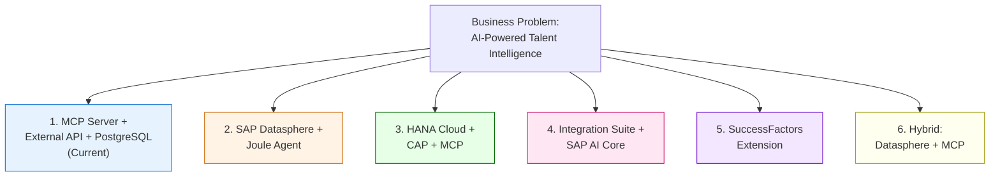
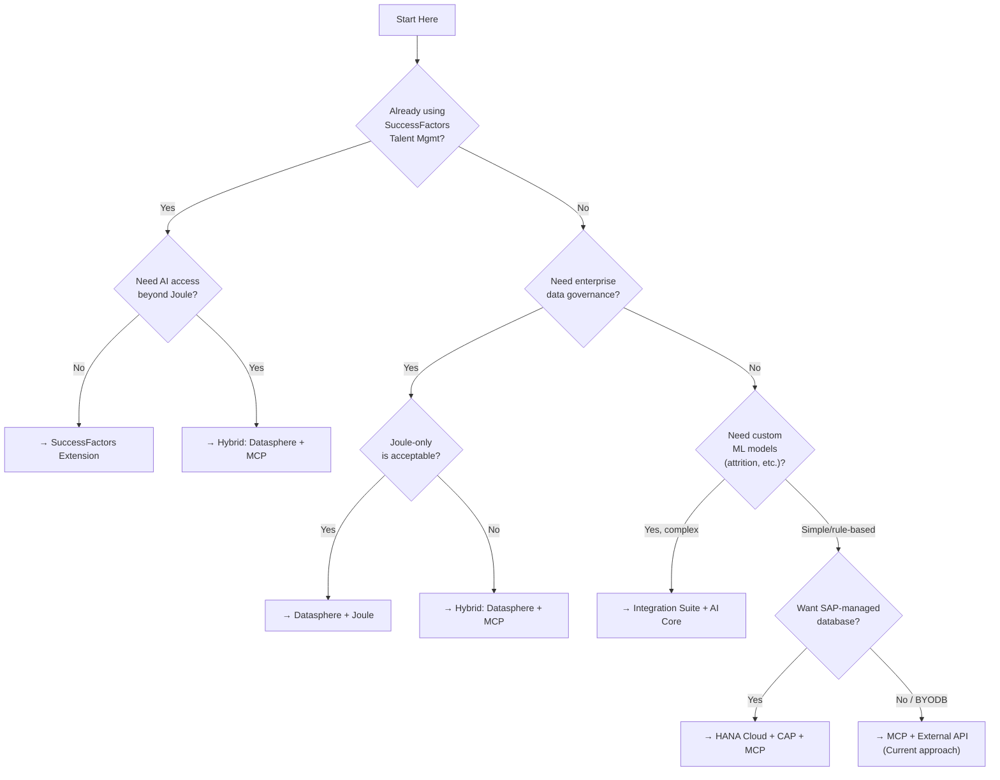
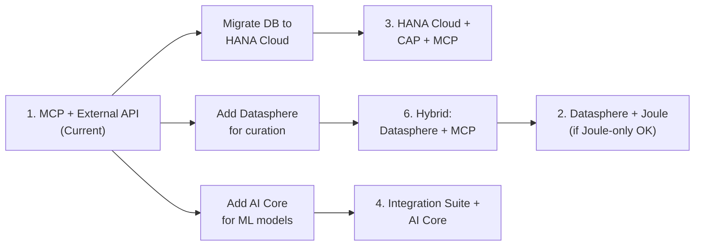

# Solution Alternatives — Talent Intelligence on SAP BTP

## The Business Problem

Organizations need **AI-powered talent intelligence**: the ability to ask natural-language questions about employee skills, expertise gaps, attrition risks, and workforce planning — and get actionable answers.

This requires three capabilities:
1. **Data layer** — Structured talent data (skills, proficiency, evidence, attrition factors)
2. **Intelligence layer** — Curation, analytics, and/or ML models that derive insights
3. **AI access layer** — An interface that lets AI agents query the data naturally

There are multiple ways to build this on SAP BTP. Each approach makes different trade-offs between flexibility, vendor lock-in, implementation complexity, and time to value.

## Solution Comparison

| # | Approach | AI Agent Access | Data Location | Complexity | Vendor Lock-in | Best For |
|---|----------|----------------|---------------|------------|----------------|----------|
| 1 | **MCP + External API** | Any MCP client | External PostgreSQL | Low | None | Rapid prototyping, multi-vendor AI |
| 2 | **Datasphere + Joule** | Joule only | SAP Datasphere | Medium | High (SAP) | SAP-native shops, governed data |
| 3 | **HANA Cloud + CAP + MCP** | Any MCP client | HANA Cloud | Medium-High | Medium (SAP DB) | Full SAP stack with MCP flexibility |
| 4 | **Integration Suite + AI Core** | API / AI Core | Multiple sources | High | Medium | Complex data pipelines, custom ML |
| 5 | **SuccessFactors Extension** | SF UI / Joule | SuccessFactors | Medium | Very High | Orgs already on SF Talent Mgmt |
| 6 | **Hybrid: Datasphere + MCP** | Any MCP client | SAP Datasphere | Medium-High | Medium | Enterprise governance + AI flexibility |

## Individual Architecture Details

Each approach is documented in its own file with a detailed Mermaid diagram, component breakdown, pros/cons, and implementation guidance:

| File | Approach |
|------|----------|
| [diagrams/current-architecture.md](diagrams/current-architecture.md) | Current: MCP Server + REST API + PostgreSQL |
| [diagrams/datasphere-joule.md](diagrams/datasphere-joule.md) | SAP Datasphere + Joule Agent |
| [diagrams/hana-cap-mcp.md](diagrams/hana-cap-mcp.md) | HANA Cloud + CAP + MCP |
| [diagrams/integration-suite-aicore.md](diagrams/integration-suite-aicore.md) | Integration Suite + SAP AI Core |
| [diagrams/successfactors-extension.md](diagrams/successfactors-extension.md) | SuccessFactors Extension |
| [diagrams/hybrid-datasphere-mcp.md](diagrams/hybrid-datasphere-mcp.md) | Hybrid: Datasphere + MCP |

## Decision Framework

Use this to pick the right approach for your situation:

## Migration Paths

The current architecture (Approach 1) can evolve incrementally:

Key insight: **the MCP server pattern is additive** — you can keep it while adding SAP services underneath. The AI agents don't need to change; only the data pipeline behind the MCP server evolves.
