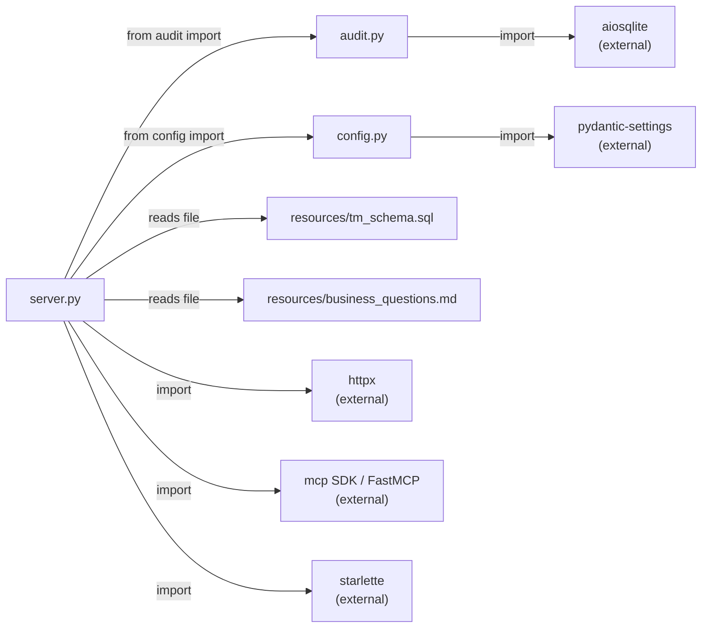
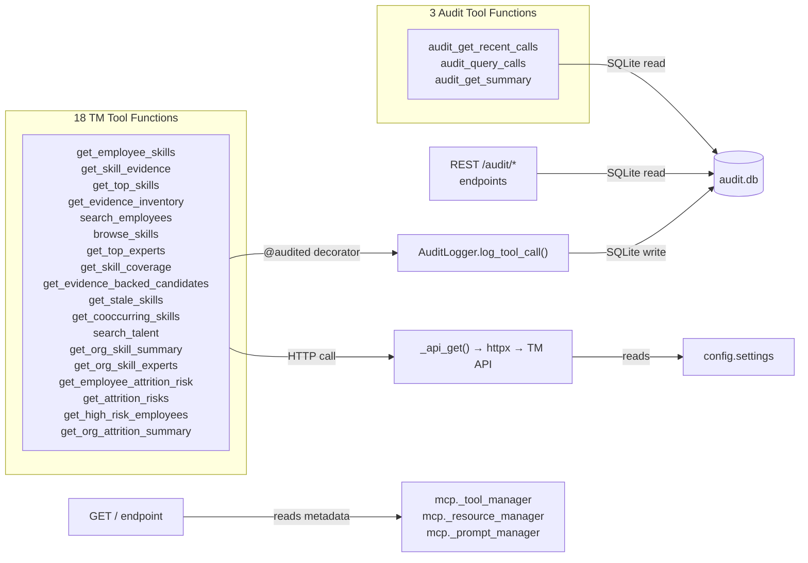
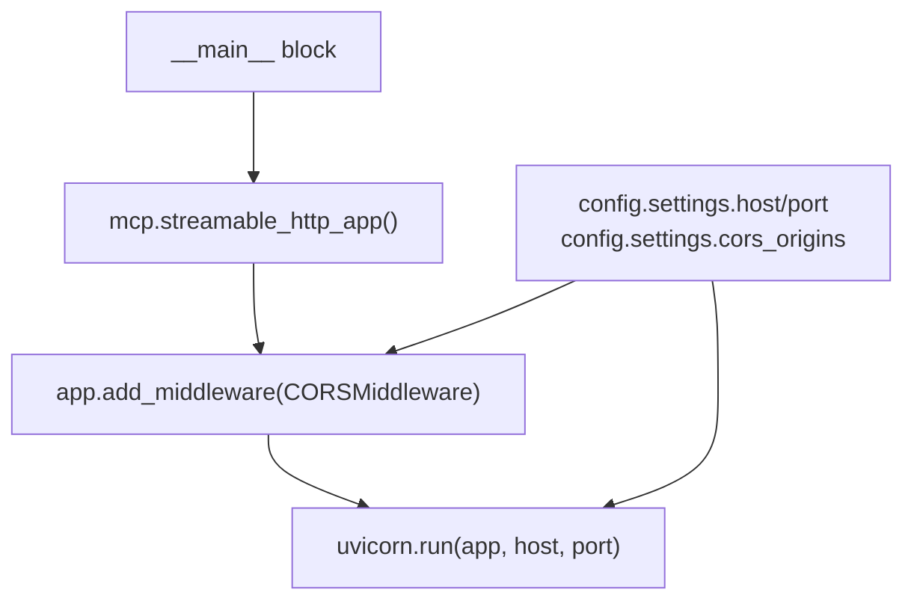

# Dependency Graph — Function Level

This document maps every function in the project and shows how they connect across files.

## High-Level File Dependencies

## Function-Level Dependency Graph

```mermaid
graph TB
    subgraph config_py["config.py"]
        Settings["Settings(BaseSettings)<br/>host, port, tm_api_base_url,<br/>tm_api_key, tm_api_timeout,<br/>audit_db_path, cors_origins"]
        settings_inst["settings = Settings()"]
        Settings --> settings_inst
    end

    subgraph audit_py["audit.py"]
        AL["AuditLogger.__init__(db_path)"]
        AL_init["AuditLogger.initialize()<br/>connect + WAL + schema"]
        AL_ensure["AuditLogger._ensure_db()<br/>lazy init guard"]
        AL_close["AuditLogger.close()"]
        AL_log["AuditLogger.log_tool_call()<br/>INSERT audit record"]
        AL_fetch["AuditLogger._fetchall_dicts()<br/>execute + Row factory"]
        AL_recent["AuditLogger.query_recent()"]
        AL_filter["AuditLogger.query_with_filters()"]
        AL_summary["AuditLogger.get_summary_stats()"]

        AL --> AL_init
        AL_ensure --> AL_init
        AL_log --> AL_ensure
        AL_recent --> AL_fetch --> AL_ensure
        AL_filter --> AL_fetch
        AL_summary --> AL_ensure
    end

    subgraph server_py["server.py"]
        subgraph init["Initialization"]
            audit_logger["audit_logger = AuditLogger(settings.audit_db_path)"]
            audit_lifespan["audit_lifespan()<br/>initialize + yield + close"]
            mcp_inst["mcp = FastMCP('tm-skills-v2', ...)"]
        end

        subgraph decorators["Decorators"]
            audited["@audited<br/>wraps tool fn, extracts ctx metadata,<br/>measures duration, calls log_tool_call"]
        end

        subgraph helpers["Helpers"]
            api_get["_api_get(path, params)<br/>httpx GET to TM API"]
            html_escape["_html_escape(text)"]
            build_ui["_build_ui_html()<br/>enumerates tools/resources/prompts"]
        end

        subgraph resources["MCP Resources (2)"]
            get_schema["get_schema()<br/>tm://schema"]
            get_bq["get_business_questions()<br/>tm://business-questions"]
        end

        subgraph employee_tools["Employee Tools (5)"]
            get_emp_skills["get_employee_skills(employee_id)"]
            get_skill_ev["get_skill_evidence(employee_id, skill_id)"]
            get_top_sk["get_top_skills(employee_id, limit)"]
            get_ev_inv["get_evidence_inventory(employee_id)"]
            search_emp["search_employees(name, limit)"]
        end

        subgraph skill_tools["Skill Tools (7)"]
            browse["browse_skills(category, search)"]
            top_experts["get_top_experts(skill_id, min_prof, limit)"]
            coverage["get_skill_coverage(skill_id, min_prof)"]
            ev_candidates["get_evidence_backed_candidates(...)"]
            stale["get_stale_skills(skill_id, older_than)"]
            cooccur["get_cooccurring_skills(skill_id, ...)"]
            search_tal["search_talent(skills, min_prof)"]
        end

        subgraph org_tools["Org Tools (2)"]
            org_summary["get_org_skill_summary(org_id, limit)"]
            org_experts["get_org_skill_experts(org_id, skill_id, ...)"]
        end

        subgraph attrition_tools["Attrition Tools (4)"]
            emp_risk["get_employee_attrition_risk(employee_id)"]
            att_risks["get_attrition_risks(limit, offset, ...)"]
            high_risk["get_high_risk_employees(threshold, ...)"]
            org_att["get_org_attrition_summary(org_id, ...)"]
        end

        subgraph audit_tools["Audit Tools (3) — NOT audited"]
            aud_recent["audit_get_recent_calls(limit)"]
            aud_query["audit_query_calls(tool_name, ...)"]
            aud_summary["audit_get_summary()"]
        end

        subgraph rest_endpoints["Audit REST Endpoints (3)"]
            rest_recent["GET /audit/recent"]
            rest_query["GET /audit/query"]
            rest_summary["GET /audit/summary"]
        end

        subgraph ui["UI"]
            ui_home["GET / → ui_home()"]
        end

        subgraph prompts["MCP Prompts (5)"]
            p_experts["find_experts(skill_name)"]
            p_analyze["analyze_employee(employee_id)"]
            p_org["org_talent_review(org_unit_id)"]
            p_attrition["assess_attrition_risk(org_unit_id)"]
            p_retention["employee_retention_review(employee_id)"]
        end
    end

    %% Cross-module dependencies
    audit_logger -->|"constructor"| AL
    audit_lifespan -->|"calls"| AL_init
    audit_lifespan -->|"calls"| AL_close
    settings_inst -->|"provides db_path"| audit_logger
    settings_inst -->|"provides base_url, api_key, timeout"| api_get

    %% All 18 TM tools → @audited → _api_get
    audited -->|"calls"| AL_log

    get_emp_skills --> audited
    get_emp_skills --> api_get
    get_skill_ev --> audited
    get_skill_ev --> api_get
    get_top_sk --> audited
    get_top_sk --> api_get
    get_ev_inv --> audited
    get_ev_inv --> api_get
    search_emp --> audited
    search_emp --> api_get

    browse --> audited
    browse --> api_get
    top_experts --> audited
    top_experts --> api_get
    coverage --> audited
    coverage --> api_get
    ev_candidates --> audited
    ev_candidates --> api_get
    stale --> audited
    stale --> api_get
    cooccur --> audited
    cooccur --> api_get
    search_tal --> audited
    search_tal --> api_get

    org_summary --> audited
    org_summary --> api_get
    org_experts --> audited
    org_experts --> api_get

    emp_risk --> audited
    emp_risk --> api_get
    att_risks --> audited
    att_risks --> api_get
    high_risk --> audited
    high_risk --> api_get
    org_att --> audited
    org_att --> api_get

    %% Audit tools → AuditLogger directly
    aud_recent -->|"calls"| AL_recent
    aud_query -->|"calls"| AL_filter
    aud_summary -->|"calls"| AL_summary

    %% REST endpoints → AuditLogger
    rest_recent -->|"calls"| AL_recent
    rest_query -->|"calls"| AL_filter
    rest_summary -->|"calls"| AL_summary

    %% UI
    ui_home --> build_ui
    build_ui --> html_escape
    build_ui -->|"reads"| mcp_inst

    %% Resources read files
    get_schema -->|"reads"| schema_file["resources/tm_schema.sql"]
    get_bq -->|"reads"| bq_file["resources/business_questions.md"]
```

## Simplified View — Call Chains

## Entry Point

## External Dependencies

| Module | Import | Used By | Purpose |
|--------|--------|---------|---------|
| `mcp.server.fastmcp` | `FastMCP`, `Context` | server.py | MCP framework |
| `httpx` | `AsyncClient` | server.py (`_api_get`) | HTTP calls to TM API |
| `pydantic_settings` | `BaseSettings` | config.py | Environment config |
| `aiosqlite` | `connect`, `Row` | audit.py | Async SQLite |
| `starlette` | `Request`, `HTMLResponse`, `JSONResponse`, `CORSMiddleware` | server.py | HTTP routing and responses |
| `uvicorn` | `run` | server.py (`__main__`) | ASGI server |
