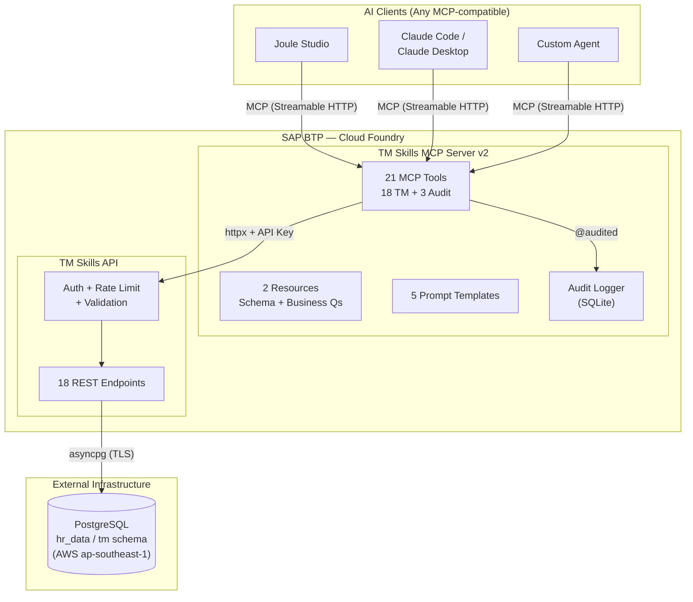

# Solution 1: MCP Server + REST API + PostgreSQL (Current)

> **This is what we have today.** A lightweight MCP server wrapping a FastAPI service, backed by an external PostgreSQL database.

## Architecture

## Components

| Component | Technology | Hosting | Purpose |
|-----------|-----------|---------|---------|
| MCP Server | Python, FastMCP, httpx | CF (256M) | Protocol bridge: MCP → HTTP |
| TM Skills API | Python, FastAPI, asyncpg | CF | Business logic, auth, validation |
| PostgreSQL | PostgreSQL 15+ | AWS RDS (ap-southeast-1) | Talent data storage |
| Audit DB | SQLite (WAL mode) | CF local filesystem | Tool invocation logging |

## Data Model

The PostgreSQL database stores:
- **employee_ref** — Employee master data (ID, name, org unit)
- **org_unit_ref** — Org hierarchy (parent-child relationships)
- **skill** — Skill catalog (93 skills across 5 categories)
- **employee_skill** — Proficiency junction (employee × skill with scores)
- **skill_evidence** — Evidence backing skill ratings (certs, projects, endorsements)
- Attrition prediction data (probability, risk factors)

## Pros

- **Vendor-neutral AI access** — Any MCP client works (Joule, Claude, custom agents)
- **Low complexity** — 3 Python files (~1050 lines total), straightforward deployment
- **Rapid iteration** — Change a tool description or add a tool in minutes
- **Clean security boundary** — MCP server is just another API client
- **No SAP service dependencies** — Works with any database, any hosting

## Cons

- **No enterprise data governance** — Data lives outside SAP's governance tools
- **Manual data pipeline** — Data must be loaded/synced into PostgreSQL externally
- **No built-in data curation** — Business logic for data quality lives in custom code
- **Ephemeral audit** — SQLite resets on CF redeploy (no persistent volume)
- **External DB management** — You manage the database (backups, scaling, security)

## When to Use This

- Rapid prototyping and proof-of-concept
- When you need multi-vendor AI access (not just Joule)
- When data already exists in an external database
- Small-to-medium datasets that don't need enterprise-grade governance
- Teams comfortable managing their own infrastructure
