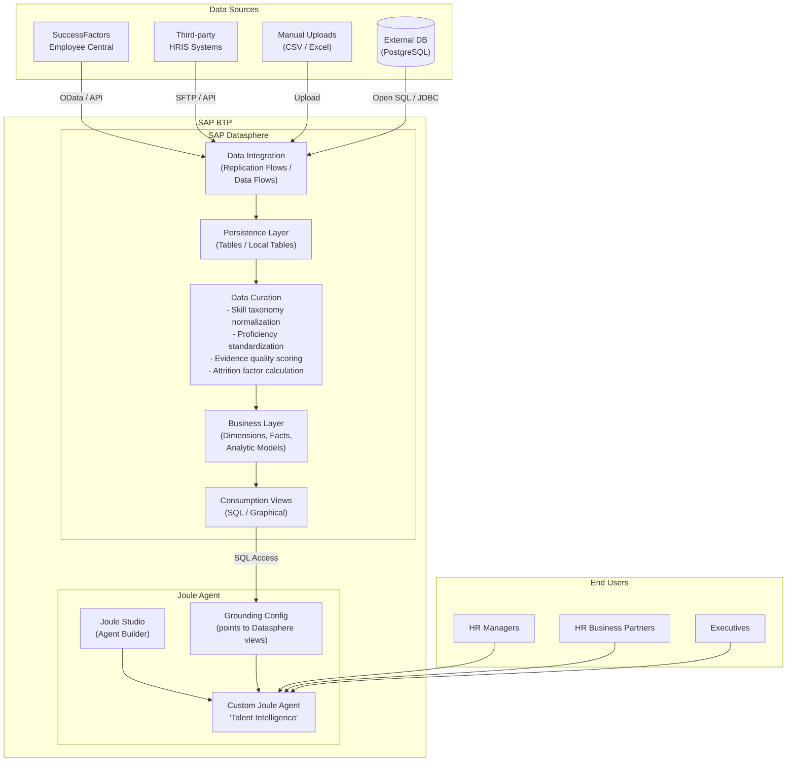
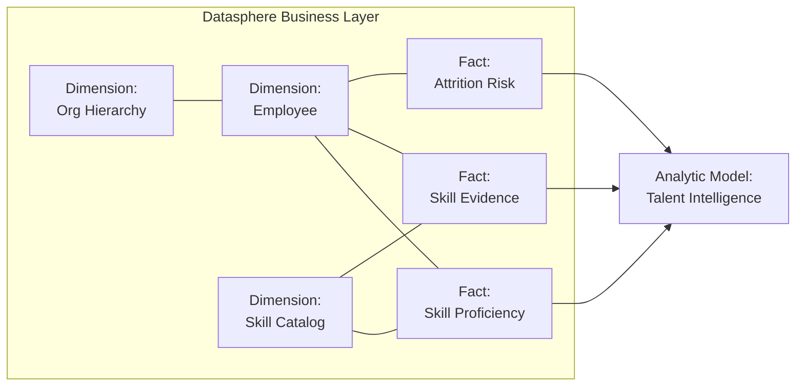

# Solution 2: SAP Datasphere + Joule Agent

> **Ingest talent data into SAP Datasphere, curate it with semantic models, and connect a custom Joule agent to the curated views.** This is similar to what the current TM app does for data curation, but leverages Datasphere's enterprise capabilities.

## Architecture

## Datasphere Data Model

## Curation Steps (What Datasphere Replaces)

The current TM app handles data curation in custom Python code. Datasphere provides these capabilities natively:

| Curation Task | Current (Custom Code) | Datasphere Approach |
|---------------|----------------------|---------------------|
| Skill taxonomy normalization | Python scripts | Graphical views + mappings |
| Proficiency standardization | API validation | Data flows with transformations |
| Evidence quality scoring | SQL queries | Calculated columns in views |
| Org hierarchy resolution | JOIN queries | Dimension hierarchies (native) |
| Attrition factor calculation | Python/SQL | Data flows with ML expressions |
| Data freshness monitoring | Custom stale-skills endpoint | Data quality monitoring |
| Access control | API key | Datasphere row-level security |

## Pros

- **Enterprise data governance** — Lineage, cataloging, quality monitoring, access control
- **Native Joule integration** — Joule agents can be grounded on Datasphere views directly
- **Semantic modeling** — Business-friendly dimensions, facts, and analytic models
- **Multi-source ingestion** — Connect SuccessFactors, HRIS, flat files, external DBs
- **Scalability** — Datasphere handles large enterprise datasets
- **Reduced custom code** — Data curation moves from Python to visual modeling

## Cons

- **Joule lock-in** — Only Joule agents can access Datasphere grounding; no Claude, no custom MCP clients
- **Datasphere licensing cost** — Significant BTP service cost (capacity units)
- **Learning curve** — Datasphere modeling concepts (spaces, connections, views, analytic models)
- **Slower iteration** — Changing a data model requires Datasphere re-modeling vs. editing a Python function
- **Limited AI agent flexibility** — Joule's agent capabilities may not match what custom MCP tools provide
- **No MCP standard** — Not usable by the broader MCP ecosystem

## When to Use This

- Your organization is already invested in SAP Datasphere
- Joule is the approved/mandated AI assistant
- Data governance and lineage are hard requirements
- Multiple data sources need to be consolidated
- You need enterprise-grade access control (row-level security, spaces)
- The data curation currently done in the TM app should move to a governed platform
