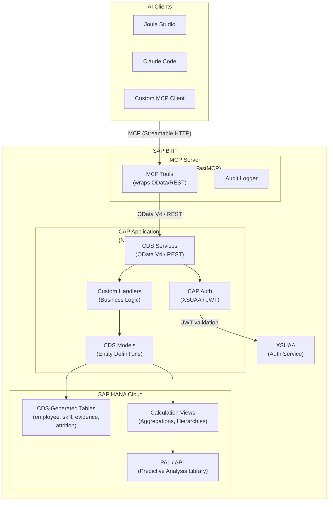
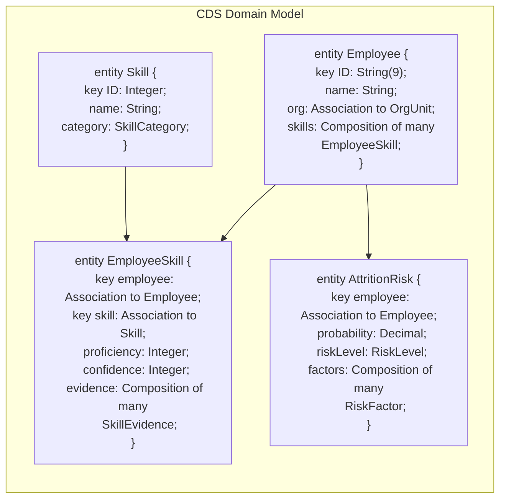
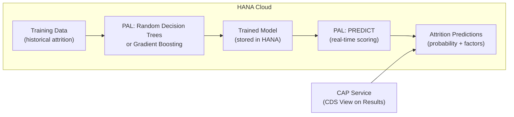

# Solution 3: HANA Cloud + CAP + MCP

> **Build the talent management service using SAP Cloud Application Programming (CAP) model on HANA Cloud, then wrap it with an MCP server for AI agent access.** Combines SAP's enterprise database with the flexibility of MCP.

## Architecture

## CDS Model Example

## Key Differences from Current Architecture

| Aspect | Current (Solution 1) | HANA + CAP + MCP |
|--------|---------------------|------------------|
| **Database** | External PostgreSQL | HANA Cloud (SAP-managed) |
| **API framework** | FastAPI (custom Python) | CAP (CDS-defined services) |
| **Data model** | SQL DDL scripts | CDS model → auto-generated DDL |
| **OData support** | None (pure REST) | Native OData V4 |
| **Authentication** | API key header | XSUAA + JWT tokens |
| **Attrition ML** | External API logic | HANA PAL/APL (in-database ML) |
| **MCP layer** | Same (FastMCP wrapper) | Same (FastMCP wrapper) |

## Attrition Prediction with HANA PAL

HANA Cloud's Predictive Analysis Library (PAL) can run attrition models **inside the database**, eliminating the need for external ML services:

## Pros

- **SAP-managed database** — HANA Cloud handles backups, scaling, HA
- **CDS modeling** — Declarative data model, auto-generated APIs, type safety
- **In-database ML** — HANA PAL for attrition prediction without external services
- **Enterprise auth** — XSUAA integration, role-based access, JWT tokens
- **MCP compatibility** — Still supports any MCP client (not locked to Joule)
- **OData V4** — Standard protocol, usable by SAP Fiori, Analytics Cloud, etc.
- **Migration path** — Can evolve toward Datasphere views later

## Cons

- **HANA Cloud cost** — Significant licensing (minimum ~$500/month)
- **CAP learning curve** — CDS syntax, service definitions, custom handlers
- **Two runtimes** — CAP app (Node.js/Java) + MCP server (Python)
- **More infrastructure** — HANA Cloud instance, XSUAA service, CAP deployment
- **Heavier deployment** — MTA (Multi-Target Application) builds
- **Over-engineered for small datasets** — HANA is designed for large-scale analytics

## When to Use This

- Your organization is committed to SAP BTP and HANA Cloud
- You need in-database ML for attrition prediction (HANA PAL)
- Enterprise-grade authentication (XSUAA) is required
- You want CDS-modeled data that can also serve Fiori apps and SAC dashboards
- You need MCP flexibility (not just Joule) but also SAP service integration
