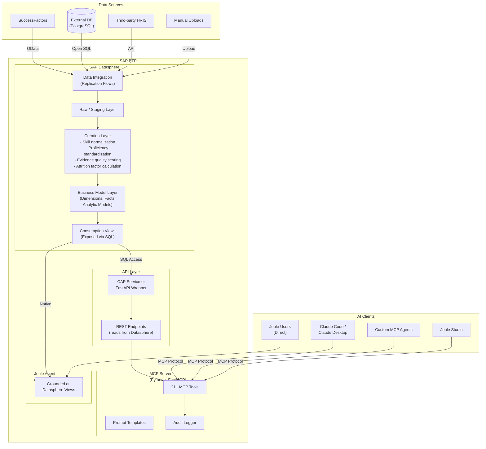
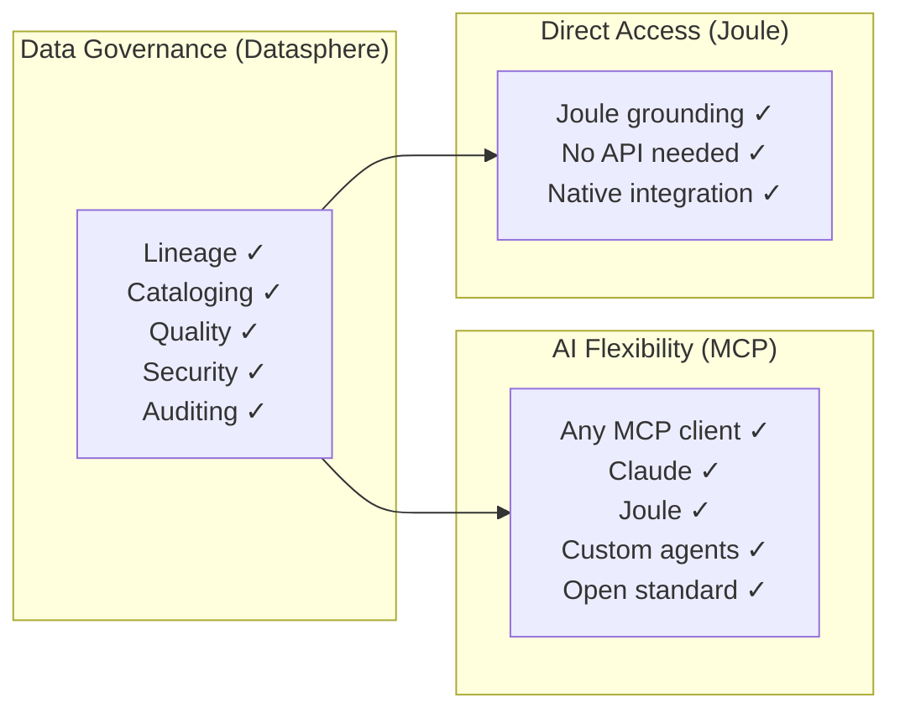
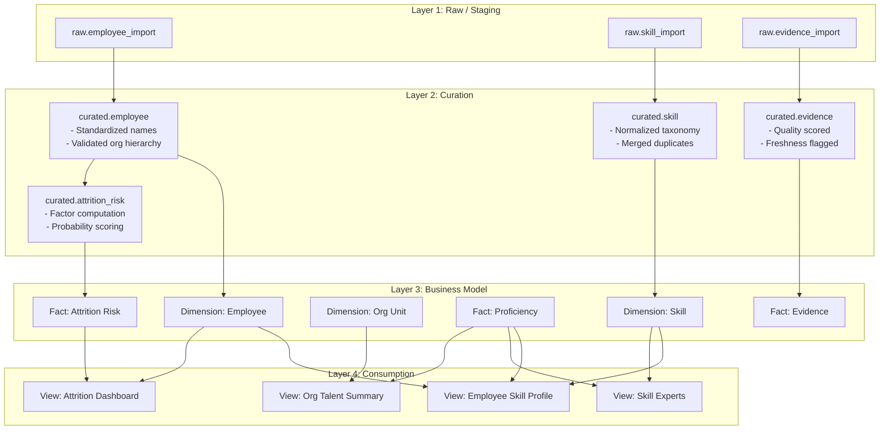
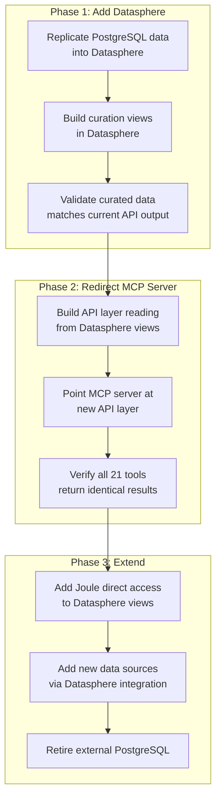

# Solution 6: Hybrid — Datasphere + MCP Server

> **Use SAP Datasphere for enterprise-grade data curation and governance, but expose the curated data through an MCP server for broad AI agent compatibility.** Best of both worlds: SAP governance + open AI access.

## Architecture

## The Hybrid Advantage

## Datasphere Curation Pipeline

## How This Compares to Pure Approaches

| Aspect | Solution 1 (Current) | Solution 2 (DS + Joule) | Solution 6 (Hybrid) |
|--------|---------------------|------------------------|---------------------|
| Data governance | None | Full | Full |
| AI agent support | Any MCP | Joule only | Any MCP + Joule |
| Data curation | Custom code | Datasphere | Datasphere |
| Implementation effort | Low | Medium | Medium-High |
| Operational cost | Low | Medium | Medium-High |
| Vendor flexibility | Full | None (SAP only) | High |

## Migration from Current Architecture

## Pros

- **Enterprise governance + open AI access** — The key differentiator
- **Not locked to one AI vendor** — Claude, Joule, and custom agents all work
- **Datasphere curation** — Professional data modeling replaces custom Python scripts
- **Incremental migration** — Move from current architecture gradually
- **Dual consumption** — Joule gets direct Datasphere access; other agents get MCP
- **Future-proof** — As MCP ecosystem grows, your data is already accessible

## Cons

- **Most infrastructure** — Datasphere + API layer + MCP server
- **Higher cost** — Datasphere licensing + CF compute for API + MCP
- **Complexity** — Three layers to maintain (Datasphere, API, MCP)
- **Datasphere learning curve** — Still need Datasphere modeling expertise
- **Latency** — Additional hop: Datasphere → API → MCP (vs. direct DB access)

## When to Use This

- You need both enterprise governance AND multi-vendor AI access
- You want Joule for SAP users but also Claude/custom agents for developers
- Your data curation needs have outgrown custom code
- You plan to consolidate multiple HR data sources over time
- Incremental migration from the current architecture is preferred over a big-bang switch
