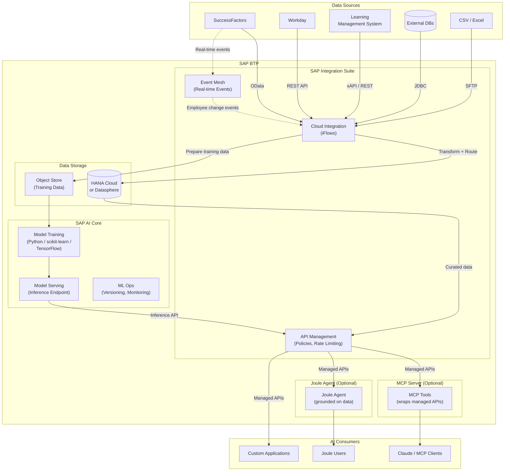
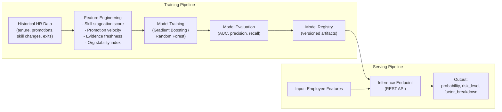
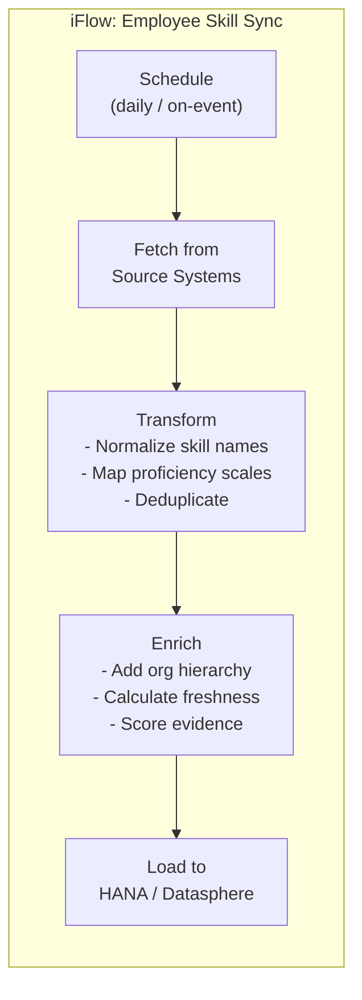

# Solution 4: SAP Integration Suite + SAP AI Core

> **Use SAP Integration Suite (Cloud Integration / CPI) to orchestrate data from multiple HR sources, and SAP AI Core to train and serve custom ML models for attrition prediction and skill intelligence.** This is the most powerful but also the most complex approach.

## Architecture

## AI Core ML Pipeline

## Integration Suite Data Flow

## Key Capabilities This Unlocks

| Capability | How It Works |
|-----------|-------------|
| **Multi-source data fusion** | CPI iFlows pull from SF, Workday, LMS, external DBs |
| **Real-time updates** | Event Mesh triggers on employee changes |
| **Custom ML models** | AI Core trains attrition, skill-gap, succession models |
| **Managed APIs** | API Management adds auth, rate limiting, analytics |
| **Model versioning** | AI Core MLOps tracks model versions and performance |
| **A/B testing** | Serve multiple model versions, compare accuracy |

## Pros

- **Most powerful ML** — Custom models trained on your data, not rule-based heuristics
- **Multi-source integration** — Consolidate data from any HR system
- **Real-time capability** — Event Mesh for immediate updates
- **Enterprise API management** — Policies, analytics, developer portal
- **MLOps** — Model versioning, monitoring, retraining pipelines
- **Dual AI access** — Both MCP (any agent) and Joule can consume

## Cons

- **Highest complexity** — Multiple BTP services to configure and manage
- **Highest cost** — Integration Suite + AI Core + HANA/Datasphere licensing
- **Longest time to value** — Requires data engineering, ML engineering, integration work
- **Skills required** — CPI iFlow development, ML model training, API Management
- **Over-engineered for simple use cases** — If you just need skill lookup, this is overkill
- **Operational overhead** — Monitor iFlows, model drift, API health, data pipelines

## When to Use This

- Large enterprise with multiple HR source systems (not just SF)
- Attrition prediction needs custom ML models (not heuristic/rule-based)
- Real-time data freshness is important
- You need managed API exposure with analytics and developer portal
- You have a dedicated data engineering / ML engineering team
- The investment is justified by the scale of the workforce analytics need
