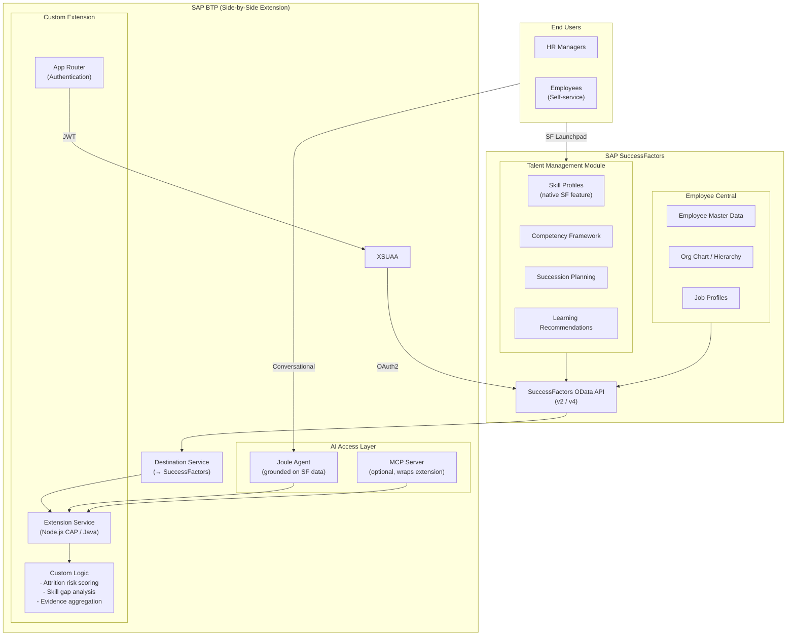
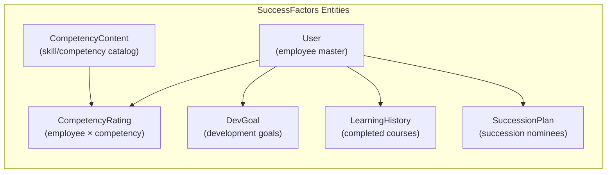

# Solution 5: SuccessFactors Extension

> **Build directly on SAP SuccessFactors' Talent Management module, extending it with a BTP side-by-side extension for AI-powered intelligence.** This leverages existing SF skill profiles and employee data without replicating them.

## Architecture

## SuccessFactors Data Model (Native)

## Extension Logic Examples

The BTP extension adds intelligence that SF doesn't provide natively:

| Custom Feature | SuccessFactors Provides | Extension Adds |
|---------------|------------------------|----------------|
| **Attrition risk** | Tenure, promotion history, manager changes | Risk scoring algorithm based on multiple factors |
| **Skill evidence quality** | Certifications, learning completions | Evidence strength scoring, freshness checks |
| **Skill gap analysis** | Job profile competencies vs. employee competencies | Gap quantification, priority ranking |
| **Expert discovery** | Competency ratings | Cross-org expert ranking with evidence weighting |
| **Skill co-occurrence** | Individual competency profiles | Statistical co-occurrence analysis |

## Pros

- **No data replication** — Reads directly from SuccessFactors via OData API
- **Leverages existing investment** — If you already have SF Talent Management, the data is there
- **SAP-supported integration pattern** — Side-by-side extension is a recommended BTP pattern
- **Single source of truth** — Employee and skill data stays in SuccessFactors
- **Standard SF UI** — Embed extension results in SF Launchpad
- **Joule-ready** — Native Joule integration with SF data

## Cons

- **SuccessFactors dependency** — Only works if you're on SF Talent Management
- **OData API limitations** — SF OData APIs can be slow for complex queries, have rate limits
- **Limited skill model** — SF Competency framework may not match your skill taxonomy
- **No offline analysis** — Every query hits SF APIs (no local cache/replica)
- **Extension maintenance** — Must keep up with SF API version changes
- **Very high vendor lock-in** — Tightly coupled to SAP SuccessFactors

## When to Use This

- Your organization is already running SAP SuccessFactors with Talent Management
- Skill profiles and competency frameworks already exist in SF
- You want to avoid data replication and maintain a single source of truth
- Joule is the primary AI assistant
- The custom intelligence (attrition scoring, expert ranking) can work with SF's data model
- You have BTP entitlements for side-by-side extensions
